<p align="center">
  
</p>

<p align="center">
  
  
  
  
</p>

<p align="center">
  
  
  
  
</p>

<p align="center">
  <b><a href="#-the-idea">Idea</a> · <a href="#-see-it-live">Live</a> · <a href="#-dashboard-views">Views</a> · <a href="#-quick-start">Quick start</a> · <a href="#-how-it-works">How it works</a> · <a href="#-security-detection">Detection</a> · <a href="#-run-it-on-a-raspberry-pi">Raspberry Pi</a> · <a href="#-roadmap">Roadmap</a></b>
</p>

> **A fast C++ capture engine feeding a beautiful terminal dashboard.** Packet Sniffer classifies live traffic across 17 protocols, extracts HTTPS domains from TLS SNI, watches DNS, and flags suspicious behaviour, all from one keyboard-driven screen.


---

## 💡 The idea

Most packet tools make you choose: raw speed with an unreadable firehose, or a pretty interface that falls behind on busy links. Packet Sniffer splits the job in two.

A small **C++17 engine on libpcap** does the heavy lifting of capturing and classifying packets. A **Python dashboard built with Rich** turns the stream into live, readable panels you can switch with a single keypress. The two halves talk over plain JSON, so each can be tested, replaced, or extended on its own.

> ⚠️ **Use responsibly.** Only capture traffic on networks you own or are explicitly authorized to monitor.

## 🎬 See it live


<p align="center"><sub>Illustrative animation of the dashboard layout. Addresses shown use reserved documentation ranges, not real traffic.</sub></p>

## 🖥️ Dashboard views

<p align="center">
  
</p>

<!--
  Add your own screenshots here for the best first impression:
  <p align="center"></p>
-->

## ✨ Features

- 📊 **Live protocol distribution.** See what is actually on your wire, updated continuously.
- 🏆 **Top talkers.** Rank hosts by traffic volume to spot the loudest devices.
- 🔐 **HTTPS domain tracking.** Server Name Indication (SNI) extraction shows which domains TLS connections are headed to.
- 🔎 **DNS query monitoring.** Watch lookups as they happen.
- 🚨 **Security alerts.** Flags DNS tunneling candidates and unencrypted protocols such as FTP.
- 🧩 **Split-screen mode.** Combine up to four panels into a custom layout.
- ⏯️ **Pause and resume** without losing context, and **clear** statistics on demand.
- 📜 **Raw packet logs** with a live viewer you can open in a new terminal.
- 🎨 **Rich terminal UI.** Colour, tables, and layout that stay readable over SSH.

## 🔧 How it works

<p align="center">
  
</p>

1. **libpcap** captures raw packets from the network interface.
2. The **C++ capture engine** (`capture_engine.cpp`) parses and classifies each packet across 17 protocols, including TCP, UDP, DNS, and HTTPS, and extracts the TLS SNI.
3. Results stream as **JSON over stdout/stdin** to the dashboard.
4. The **Python dashboard** (`dashboard.py`) aggregates the stream into panels, raises alerts, and writes raw logs.

| Component | Language | Responsibility |
| --- | --- | --- |
| `capture_engine.cpp` | C++17 | High-performance capture, parsing, classification |
| `dashboard.py` | Python | Rich terminal UI, aggregation, alerts, key handling |
| JSON stream | n/a | Decoupled hand-off between engine and UI |

## 🚨 Security detection

The dashboard currently raises these alerts (press **`A`** to open them):

| Alert | What it catches | Why it matters |
| --- | --- | --- |
| **DNS tunneling** | Unusually long DNS queries | A common sign of data exfiltration hidden inside DNS |
| **Unencrypted protocols** | FTP and other insecure traffic | Credentials and data can be read in transit |

> These are lightweight heuristics intended for learning and quick triage, not a replacement for a full IDS.

## ⚡ Quick start

**Prerequisites:** Ubuntu/Debian Linux (or any Linux with `apt`), `libpcap` development files, `g++` with C++17, Python 3.7+, and the Python `rich` library.

### One-line install (Ubuntu/Debian)

```bash
git clone https://github.com/YugRokadia/Packet-Sniffer.git
cd Packet-Sniffer
chmod +x install.sh
./install.sh
```

The installer will:

- install the required dependencies (libpcap, g++, Python packages)
- compile the C++ capture engine
- set up a desktop application launcher
- configure the permissions the engine needs

### Manual install

```bash
# 1. System dependencies
sudo apt-get install libpcap-dev g++ python3 python3-pip

# 2. Python dependencies
pip3 install rich

# 3. Compile the capture engine
g++ -std=c++17 -o capture_engine capture_engine.cpp -lpcap

# 4. Permissions for raw capture
sudo chown root:root capture_engine
sudo chmod u+s capture_engine

# 5. Run
python3 dashboard.py
```

> 🔒 **Security note:** step 4 makes `capture_engine` a setuid-root binary so it can open the network interface. Review `capture_engine.cpp` before installing it on a shared machine.

## 🎮 Usage

Launch **Packet Sniffer** from your applications menu, or from a terminal:

```bash
python3 dashboard.py
```

Press **`?`** at any time to toggle the in-app help.

| Key | Action | Key | Action |
| :---: | --- | :---: | --- |
| `P` | Protocol breakdown | `L` | Raw logs panel |
| `T` | Top talkers | `O` | Overview (all panels) |
| `D` | HTTPS domains | `S` | Split-screen mode |
| `N` | DNS queries | `Space` | Pause / resume capture |
| `R` | Recent packets | `C` | Clear all statistics |
| `A` | Security alerts | `V` | View logs in a new terminal |
| `?` | Help | `Q` | Quit |

### Split-screen mode

1. Press **`S`** to enter split mode.
2. Press panel keys (**`P`**, **`T`**, **`D`**, **`N`**, ...) to add panels, from one up to four.
3. Press **`S`** again to exit, or **`O`** to return to the overview.

See [`DASHBOARD_KEYS.md`](DASHBOARD_KEYS.md) for the full keyboard reference.

## 🍓 Run it on a Raspberry Pi

Packet Sniffer runs well on small Linux boards. It has been deployed on a **Raspberry Pi 4B configured as a secondary router**, which makes it a handy always-on network monitor you reach over SSH:

```bash
ssh <user>@<pi-address>
cd Packet-Sniffer
python3 dashboard.py
```

Because the interface is a terminal UI, the same dashboard works over SSH with no extra setup.

## 🧪 Compatibility

| Platform | Status |
| --- | :---: |
| Ubuntu / Debian / Mint | ✅ Supported |
| Fedora / RHEL / CentOS | ✅ Supported |
| Arch Linux | ✅ Supported |
| Raspberry Pi | ✅ Supported |
| Windows | ⚠️ Use WSL2 |
| macOS | ⚠️ Requires modifications |

## 📁 Project structure

```
Packet-Sniffer/
├── capture_engine.cpp     # C++17 / libpcap capture and classification engine
├── dashboard.py           # Rich terminal dashboard (entry point)
├── analyzer.py            # Traffic analysis helpers
├── sniffer.py             # Capture helpers
├── security_alerts        # Alert rules (DNS tunneling, unencrypted protocols)
├── install.sh             # One-step installer
├── run.sh                 # Launcher script
├── Makefile               # Build the capture engine
├── requirements.txt       # Python dependencies
├── DASHBOARD_KEYS.md      # Keyboard reference
├── icon.png               # Launcher icon
└── LICENSE                # MIT
```

## 🛠️ Troubleshooting

**`Permission denied` or no packets appear**
The capture engine needs privileges to open the interface. Re-run the permission step (`chown root:root` and `chmod u+s`) or start the dashboard with `sudo`.

**`pcap.h: No such file or directory` while compiling**
Install the development headers: `sudo apt-get install libpcap-dev`.

**The dashboard looks garbled**
Use a terminal with true-colour and Unicode support, and make it large enough for the layout. Split-screen mode benefits from a wide window.

## ❓ FAQ

**Does it capture packet payloads?**
It classifies packets and extracts metadata such as protocol, hosts, DNS names, and TLS SNI. Raw packet logs are written locally, so treat them as sensitive.

**Can it decrypt HTTPS?**
No. It reads the unencrypted SNI field from the TLS handshake to show which domain a connection targets, and nothing inside the encrypted session.

**Why C++ and Python?**
C++ keeps capture fast and predictable. Python with Rich makes the interface quick to build and easy to change.

## 🗺️ Roadmap

- [x] C++ libpcap capture engine
- [x] Rich dashboard with live panels and split-screen mode
- [x] DNS tunneling and unencrypted-protocol alerts
- [x] One-step Linux installer and desktop launcher
- [ ] PCAP export for offline analysis in other tools
- [ ] More detection rules
- [ ] First-class macOS support

## 🤝 Contributing

Issues and pull requests are welcome. Please describe your platform and how you tested the change.

## 🙏 Acknowledgements

- [libpcap](https://www.tcpdump.org/)
- [Rich](https://github.com/Textualize/rich)

## 📄 License

Released under the [MIT License](LICENSE). Copyright (c) 2026 Yug Rokadia.

<p align="center"><sub>Built to make network traffic readable. 📡</sub></p>
